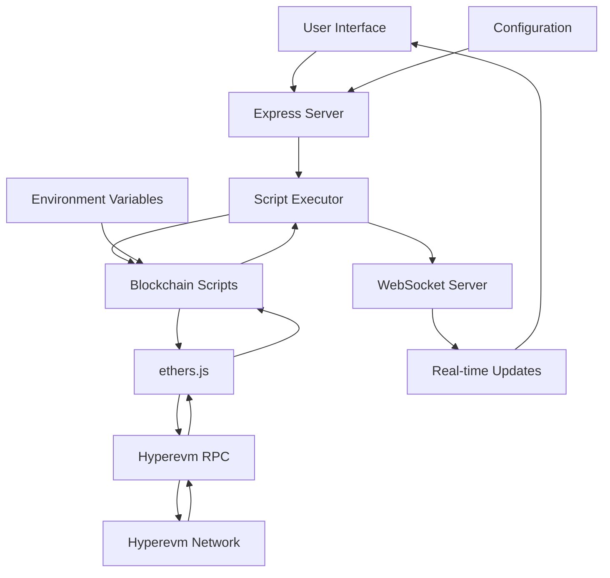

# Hyperevm Chain Tools データフロー設計書

## 1. 全体データフロー概要



## 2. 詳細データフロー

### 2.1 リクエスト処理フロー

#### 2.1.1 スクリプト一覧取得

```
[Client] GET /api/scripts
    ↓
[Express Server] 静的スクリプト情報を返却
    ↓
[Client] スクリプト一覧を表示
```

**データ形式:**
```json
{
  "scripts": [
    {
      "name": "balance_check.js",
      "description": "アドレスの残高を確認する",
      "parameters": ["address1", "address2..."]
    }
  ]
}
```

#### 2.1.2 スクリプト実行フロー

```
[Client] POST /api/execute-script
    ↓
[Express Server] リクエスト検証
    ↓
[Script Executor] 子プロセス生成
    ↓
[Blockchain Script] 実行開始
    ↓
[ethers.js] RPC通信
    ↓
[Hyperevm Network] ブロックチェーン処理
    ↓
[ethers.js] レスポンス受信
    ↓
[Blockchain Script] 結果処理
    ↓
[Script Executor] 出力キャプチャ
    ↓
[Express Server] 結果をWebSocketでブロードキャスト
    ↓
[Client] リアルタイム結果表示
```

### 2.2 WebSocket通信フロー

#### 2.2.1 接続確立

```
[Client] WebSocket接続要求
    ↓
[WebSocket Server] 接続受け入れ
    ↓
[Client] 接続状態表示更新
```

#### 2.2.2 リアルタイム更新

```
[Script Execution] 完了
    ↓
[WebSocket Server] 結果をブロードキャスト
    ↓
[All Connected Clients] 結果受信
    ↓
[Client UI] 結果表示更新
```

## 3. コンポーネント間データフロー

### 3.1 balance_check.js データフロー

```
Input: ["0x1234..."]
    ↓
HyperevmBalanceChecker.checkMultipleBalances()
    ↓
for each address:
    ↓
    provider.getBalance(address)
        ↓
        RPC Call: eth_getBalance
            ↓
            Hyperevm Network
            ↓
        Balance Response
    ↓
    ethers.utils.formatEther(balance)
    ↓
Output: [{"success": true, "address": "0x1234...", "balance": "1.23", ...}]
```

### 3.2 transaction_sender.js データフロー

```
Input: ["0x5678...", "0.1"]
    ↓
HyperevmTransactionSender.sendTransaction()
    ↓
Transaction Object Creation:
    - to: "0x5678..."
    - value: parseEther("0.1")
    - gasLimit: 21000
    - gasPrice: await provider.getGasPrice()
    ↓
wallet.sendTransaction(tx)
    ↓
RPC Call: eth_sendRawTransaction
    ↓
Hyperevm Network
    ↓
Transaction Hash Response
    ↓
transaction.wait() - 確認待機
    ↓
Output: {"success": true, "transactionHash": "0xabc...", ...}
```

### 3.3 contract_interaction.js データフロー

#### 3.3.1 読み取り操作

```
Input: [contractAddress, abi, methodName, params]
    ↓
contract = new ethers.Contract(contractAddress, abi, provider)
    ↓
result = await contract[methodName](...params)
    ↓
RPC Call: eth_call
    ↓
Hyperevm Network
    ↓
Call Result
    ↓
Output: {"success": true, "result": "...", ...}
```

#### 3.3.2 書き込み操作

```
Input: [contractAddress, abi, methodName, params, options]
    ↓
contract = new ethers.Contract(contractAddress, abi, wallet)
    ↓
tx = await contract[methodName](...params, options)
    ↓
RPC Call: eth_sendRawTransaction
    ↓
Hyperevm Network
    ↓
Transaction Hash Response
    ↓
await tx.wait() - 確認待機
    ↓
Output: {"success": true, "transactionHash": "0xdef...", ...}
```

## 4. エラーハンドリングフロー

### 4.1 ネットワークエラー

```
[ethers.js] RPC通信
    ↓
[Network Error] 接続失敗
    ↓
[Script] catch(error)
    ↓
[Output] {"success": false, "error": "network error", ...}
```

### 4.2 バリデーションエラー

```
[Script] パラメータ検証
    ↓
[Invalid Input] 無効な値
    ↓
[Script] エラー処理
    ↓
[Output] {"success": false, "error": "invalid parameter", ...}
```

### 4.3 ブロックチェーンエラー

```
[Hyperevm Network] 処理失敗
    ↓
[RPC Error Response] エラー情報
    ↓
[ethers.js] エラー解析
    ↓
[Script] catch(error)
    ↓
[Output] {"success": false, "error": "transaction failed", ...}
```

## 5. 状態管理

### 5.1 クライアント状態

```javascript
{
  connectionStatus: 'connected' | 'disconnected' | 'connecting',
  scripts: [...],
  executionHistory: [...],
  currentExecution: {
    scriptName: string,
    args: array,
    status: 'pending' | 'running' | 'completed' | 'failed'
  }
}
```

### 5.2 サーバー状態

```javascript
{
  connectedClients: Set<WebSocket>,
  runningScripts: Map<processId, {
    scriptName: string,
    args: array,
    startTime: Date,
    process: ChildProcess
  }>,
  scriptDefinitions: [...],
  environment: {
    HYPEREVM_RPC_URL: string,
    PRIVATE_KEY: string,
    PORT: number
  }
}
```

## 6. データ変換

### 6.1 金額変換

```javascript
// Wei → Ether
ethers.utils.formatEther(weiAmount)

// Ether → Wei
ethers.utils.parseEther(etherAmount)
```

### 6.2 アドレス変換

```javascript
// チェックサム化
ethers.utils.getAddress(address)

// 有効性チェック
ethers.utils.isAddress(address)
```

### 6.3 日付変換

```javascript
// ISO文字列生成
new Date().toISOString()

// ローカル時間表示
new Date(timestamp).toLocaleString('ja-JP')
```

## 7. キャッシュ戦略

### 7.1 クライアントサイドキャッシュ

```javascript
// スクリプト定義のキャッシュ
localStorage.setItem('scripts', JSON.stringify(scripts))

// 実行履歴のキャッシュ（最大10件）
const history = JSON.parse(localStorage.getItem('executionHistory') || '[]')
history.unshift(newResult)
if (history.length > 10) {
  history.pop()
}
localStorage.setItem('executionHistory', JSON.stringify(history))
```

### 7.2 サーバーサイドキャッシュ

```javascript
// ガス価格キャッシュ（1分間）
const gasPriceCache = new Map()
if (!gasPriceCache.has('gasPrice') || 
    Date.now() - gasPriceCache.get('timestamp') > 60000) {
  const gasPrice = await provider.getGasPrice()
  gasPriceCache.set('gasPrice', gasPrice)
  gasPriceCache.set('timestamp', Date.now())
}
```

## 8. パフォーマンス最適化

### 8.1 並列処理

```javascript
// 複数残高チェックの並列実行
const balancePromises = addresses.map(address => 
  this.checkBalance(address)
)
const results = await Promise.all(balancePromises)
```

### 8.2 接続プーリング

```javascript
// ethers.js プロバイダーの再利用
const provider = new ethers.providers.StaticJsonRpcProvider(rpcUrl, network)
// 全スクリプトで同一プロバイダーを使用
```

## 9. セキュリティ考慮事項

### 9.1 データサニタイゼーション

```javascript
// 入力値の検証
function validateAddress(address) {
  if (!ethers.utils.isAddress(address)) {
    throw new Error('Invalid address format')
  }
  return ethers.utils.getAddress(address)
}
```

### 9.2 機密情報の保護

```javascript
// 秘密鍵の検証（ダミーキーの検出）
if (privateKey === '0x' + '0'.repeat(64)) {
  throw new Error('Please set a valid private key')
}
```

## 10. 監視とログ

### 10.1 実行ログ

```javascript
console.log(JSON.stringify({
  timestamp: new Date().toISOString(),
  scriptName: 'balance_check.js',
  args: ['0x1234...'],
  duration: Date.now() - startTime,
  success: true
}))
```

### 10.2 エラーログ

```javascript
console.error(JSON.stringify({
  timestamp: new Date().toISOString(),
  scriptName: 'transaction_sender.js',
  error: error.message,
  stack: error.stack
}))
```